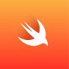

We want to support "Kids reading - with word, sentence and fun"

#App 


#Installation
Our provided APIs are implemented with [vapor](https://vapor.codes/) and [swift](https://swift.org/) and using [mongodb](https://www.mongodb.com/) or [postgreSQL](https://www.postgresql.org/)

## Backend using Swift and Vapor
[](https://vapor.codes/) [](https://swift.org/)

todo

## install local postgreSQL database on Mac
[](https://www.postgresql.org/) 

###install Postgres.App on Mac
[](http://postgresapp.com/)

- download, install in Applications and run
- see the icon  and configure
- install postgreSQL locally on Mac. This is needed because vapor - swift code needs C-headers from local Postgres installation


```bash
brew install postgresql
brew link postgresql

//run the following lines if NOT using Postgres.App
//start
brew services start postgresql

//stop
brew services stop postgresql
```
- you do not need to start postgresql if you have Postgres.App running
- for further help see https://github.com/vapor/postgresql

###configure Postgres access in vapor using Fluent
add postgresql-provider in vapor packages dependencies

modify Package.swift
```swift
let package = Package(
    ...
    dependencies: [
        .Package(url: "https://github.com/vapor/vapor.git", majorVersion: 1, minor: 1),
        .Package(url: "https://github.com/vapor/postgresql-provider", majorVersion: 1)
    ],
    ...
)
```
close Xcode


run vapor xcode to generate and download the needed ressources
```bash
cd vapor/kids-reading-server
vapor xcode
```

you will see the output and
type y to open automatically Xcode

```bash
Fetching Dependencies [Done]
Generating Xcode Project [Done]
Select the `App` scheme to run.
Open Xcode project?
y/n>y
```


modify main.swift to add provider

```swift
import VaporPostgreSQL

let drop = Droplet()
drop.preparations.append(Post.self)
try drop.addProvider(VaporPostgreSQL.Provider.self)
```

add configuration file  in Config/secrets/postgresql.json

```JSON
{
    "host": "127.0.0.1",
    "user": "<your login name on mac>",
    "password": "",
    "database": "<your login name on mac>",
    "port": 5432
}
```

## install local mongodb database
[](https://www.mongodb.com/)

install your mongodb locally on your local machine via [mongodb website](https://www.mongodb.com/) or use apt-get to download any linux packages. Read mongodb download support material how to install on your infrastructure.
every mongdb needs a "data" directory. Out "data" directory for mongodb is already a part of .gitignore.

```bash
cd vapor
mkdir data
cd data
mongod --dbpath `pwd` --port 27018

//port 27018 just to not mess up with any other default 27017 mongodb port
//our database we are connecting to is named "kids-reading"
````

###configure mongodb access in vapor using Fluent
read full documentation [GIT hub project mongo-provider](https://github.com/vapor/mongo-provider)

modify Package.swift
```swift
let package = Package(
    ...
    dependencies: [
        .Package(url: "https://github.com/vapor/vapor.git", majorVersion: 1, minor: 1),
        .Package(url: "https://github.com/vapor/mongo-provider.git", majorVersion: 1, minor: 1)
    ],
    ...
)
```
close Xcode


run vapor xcode to generate and download the needed ressources
```bash
cd vapor/kids-reading-server
vapor xcode
```

you will see the output
type y to open automatically Xcode
```bash
Fetching Dependencies [Done]
Generating Xcode Project [Done]
Select the `App` scheme to run.
Open Xcode project?
y/n>y
```

modify main.swift to add provider
```swift
import VaporMongo
import FluentMongo

let drop = Droplet()
drop.preparations.append(Post.self)
try drop.addProvider(VaporMongo.Provider.self)

```


